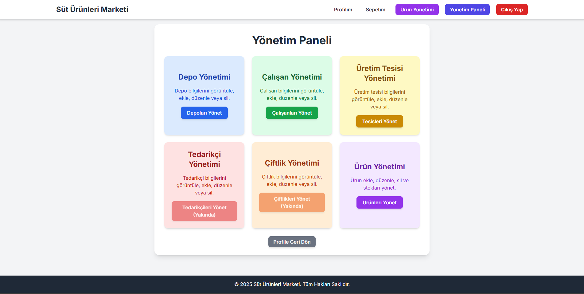

# 🥛 Süt ve Süt Ürünleri Üretim Tesisleri Web Tabanlı Yönetim Sistemi

Bu proje, bir süt ve süt ürünleri üretim tesisinin operasyonel süreçlerini yönetmek amacıyla geliştirilmiş kapsamlı bir web tabanlı yönetim sistemidir. Kullanıcı kaydı, güvenli oturum yönetimi, ürün yönetimi (CRUD), rol bazlı erişim kontrolü ve depo/üretim tesisi takibi gibi birçok modül içermektedir. Arayüz, Tailwind CSS ile mobil uyumlu ve kullanıcı dostudur.

---

## ✨ Özellikler

### 👤 Kullanıcı Yönetimi
- Güvenli kullanıcı kaydı ve giriş (şifreler `password_hash()` ile şifrelenir)
- Session tabanlı oturum yönetimi
- Profil güncelleme ve silme
- Rol bazlı yetkilendirme (Admin, Çalışan, Müşteri)

### 📦 Ürün Yönetimi
- Ürün ekleme, görüntüleme, düzenleme ve silme (CRUD)
- Ürün görseli yükleme ve detay sayfası

### 🧑‍💼 Çalışan Yönetimi (Admin)
- Çalışan ekleme, düzenleme, silme
- Kullanıcılarla ilişkilendirme
- Görev yeri (depo, üretim tesisi, çiftlik) tanımı

### 🏢 Depo ve Üretim Tesisi Yönetimi
- Depo ve üretim tesisi CRUD işlemleri
- Adres ve sorumlu çalışan yönetimi

### 🎨 Duyarlı (Responsive) Arayüz
- Mobil, tablet ve masaüstü uyumlu arayüz
- Tailwind CSS ile sade, modern tasarım

---

## 💻 Kullanılan Teknolojiler

| Katman       | Teknoloji                  |
|--------------|----------------------------|
| Backend      | PHP (Yalın / Vanilla)      |
| Veritabanı   | MySQL                      |
| Frontend     | HTML5, Tailwind CSS, JS    |
| DB Bağlantı  | MySQLi (PHP eklentisi)     |

---

## 🚀 Kurulum Talimatları

### 1️⃣ Veritabanı Kurulumu
1. `epazar_db` adında yeni bir veritabanı oluşturun.
2. `veritabani/epazar_db.sql` dosyasını içeri aktarın. (phpMyAdmin kullanabilirsiniz)
3. (İsteğe bağlı) Karakter setini ayarlayın:
   ```sql
   ALTER DATABASE epazar_db CHARACTER SET utf8mb4 COLLATE utf8mb4_unicode_ci;
# 2️⃣ Veritabanı Bağlantısı (db.php)

`db-example.php` dosyasını kopyalayarak `db.php` adında yeni bir dosya oluşturun.

Kendi veritabanı bilgilerinizi girin:

```php
<?php
$servername = "localhost";
$username = "root";
$password = "";
$dbname = "epazar_db";

$mysqli = new mysqli($servername, $username, $password, $dbname);

if ($mysqli->connect_error) {
    die("Veritabanı bağlantısı başarısız: " . $mysqli->connect_error);
}
?>
```

---
# 🔐 Admin Girişi İçin Kullanıcı Oluşturma

```sql
-- Örnek Admin hesabı oluştur
INSERT INTO kullanici (kullanici_adi, email, ad, soyad, sifre)
VALUES ('adminuser', 'admin@example.com', 'Admin', 'Kullanici', '$2y$10$HASHLI_SIFRE');

-- Rol ID'sini öğren
SELECT rolID FROM rol WHERE rol_adi = 'Admin';

-- Admin rolünü kullanıcıya ata
INSERT INTO kullanici_rol (kullaniciID, rolID)
VALUES ((SELECT kullaniciID FROM kullanici WHERE kullanici_adi = 'adminuser'), 1);
```

---
# 📸 Ekran Görüntüleri




---

# 🎥 Tanıtım Videosu

[Tanıtım videosunu buraya tıklayarak izleyebilirsin](https://www.youtube.com/watch?v=Jy1KBQAxRFE&t=5s)

---

---

# 📫 Geliştirici

**Ahmet Güldaş**  
GitHub: [@guldasahmet](https://github.com/guldasahmet)
